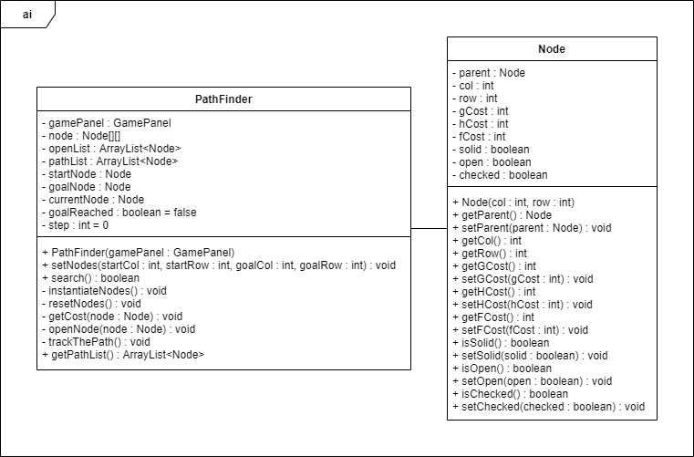

# TEAM_NULL's OOP Project

This repository is created specifically for the OOP course's final project :3

## 1. INTRODUCTION

### 1.1. Motivation

This project is created with the hopes to not only pass the OOP course, but to also gain valuable knowledge regarding the uses of Java programming language and the application of OOP's core principles. In addition, our team has been able to learn how a simple (yet not really simple) Java 2D game functions, using only the internal Java libraries.

We hope that this project will prove to be useful for you, who is currently reading these lines, in your path to learning Java and game programming. Love, TEAM_NULL.

### 1.2. About Our Team

#### Team Name:

TEAM_NULL

#### Team Members' Info:

| Members             |     ID      | Email                            |
| ------------------- | :---------: | -------------------------------- |
| Nguyen Hong Quan    | ITITIU18297 | ITITIU18297@student.hcmiu.edu.vn |
| Nguyen Le Thanh Tai | ITITIU20298 | ITITIU20298@student.hcmiu.edu.vn |
| Nguyen Hoang Luan   | ITITIU20012 | ITITIU20012@student.hcmiu.edu.vn |
| Hoang Minh Khoi     | ITITIU20232 | ITITIU20232@student.hcmiu.edu.vn |

#### Team Members' Responsibility:

| Members             | Responsibility                                               |
| ------------------- | ------------------------------------------------------------ |
| Nguyen Hong Quan    | Project Manager, Developer, Overall Framework, Miscellaneous |
| Nguyen Le Thanh Tai | Developer, Character Upgrade                                 |
| Nguyen Hoang Luan   | Developer, Monsters                                          |
| Hoang Minh Khoi     | Developer, Coins                                             |

### 1.3. About Our Game

#### Game's Name:

PRINCESS RESCUE

#### Game's Genre/Tags:

2D, Indie, Action, Roguelike, Casual, Survival

#### Game's Lore:

You are an adventurer. Through many rumors and stories told by the common folks and traveling merchants, you found out that an unknown princess is being held captive in the land governed by the monsters. You then decide to embark on a journey to the mentioned eerie and isolated land, feeling strangely motivated to rescue the girl from such cruel captivation.

#### Game's Rules:

1. Your goal is to fight through hordes of monsters and survive for a certain period of time. After surviving the monsters' attacks, the princess now awaits...
2. Starting out with just your trusty whip, you must press on and survive this hellhole. Multiple upgrades for your physique will also be available before starting your journey. You should reserve your wallet for these upgrades if you want an easier life.
3. You can also develop your body by defeating enemies and earning EXP. You will be rewarded with upgrades to your stats at each level. Do pay attention that each time you level up, the required amount of EXP required to reach the next level will also increase.
4. As time goes by, more and more enemies will start to spawn. That being said, it is recommended that you try to scavenge the area around you to find as much useful stuff as you can before things get out of hand.

### 2. TECHNOLOGY USED:

1. Programming language: Java (100%)
2. Library: Internal Java libraries
   - Graphics: Graphics, Graphics2D, BufferedImage, AlphaComposite, Rectangle, etc.
   - Sound: URL, AudioInputStream, AudioSystem, Clip, FloatControl, etc.
   - Key Inputs: KeyEvent, KeyListener.
   - Save/Load to/from Files: BufferedWriter, BufferedReader, FileWriter, FileReader, etc.
   - Others: DataFormat, etc.
3. Framework: Created by following the tutorial video[^link].
   [^link]: How to Make a 2D Game in Java: https://www.youtube.com/watch?v=om59cwR7psI&list=PL_QPQmz5C6WUF-pOQDsbsKbaBZqXj4qSq

### 3. UML CLASS DIAGRAM:

**Due to the complexity of the diagram, we decided to omit most of the relationships between packages to increase visibility.**

#### 3.1. 'main' package:

#### 3.2. 'tiles' package:

#### 3.3. 'ai' package:

#### 3.4. 'entity' package:

##### 3.4.1. 'entity.monster' package:

##### 3.4.2. 'entity.npc' package:

##### 3.4.3. 'entity.object' package:

###### 3.4.3.1. 'entity.object.coin' package:

###### 3.4.3.1. 'entity.object.weapon' package:

###### 3.4.3.1. 'entity.object.shield' package:

### 4. FEATURES:

#### Completed:

1. Basic character's movements/actions.
2. In-game item usage.
3. Monsters can drop pickups.
4. Monsters can follow the player (A\* algorithm).
5. Functional gameplay configurations.
6. Save/Load system's configurations (Fullscreen on/off, volumes' adjustments).
7. Functional Character Upgrade feature.
8. Save/Load player's upgrades (Total money, current stats, upgrade costs).
9. After surviving for a specified time, the monsters are cleared, and the princess is spawned.
10. The timer works fine.

#### Incompleted:

1. Not yet a multi-threaded game (still single).
2. The monster's AI is not good enough => Can get stuck.
3. The stopping of the player's camera and its actual location causes a bug.
4. The monster spawner is not yet made => No monster waves yet.
5. The codes in multiple parts are still quite messy and not optimized.
6. Sometimes there are small jumps in the FPS.

#### To be developed:

1. Improve/Fix the above 6 incompleted features.
2. Add more variety to the game => Make it more lively, hardcore, fastpaced
3. Boost the game's performance

### 5. CHALLENGES ENCOUNTERED:

1. Most of the team members are not familiar with Java and OOP yet.
2. Most of the team members are not able to read and understand codes thoroughly.
3. Problems with the IDE, file lost, etc.
